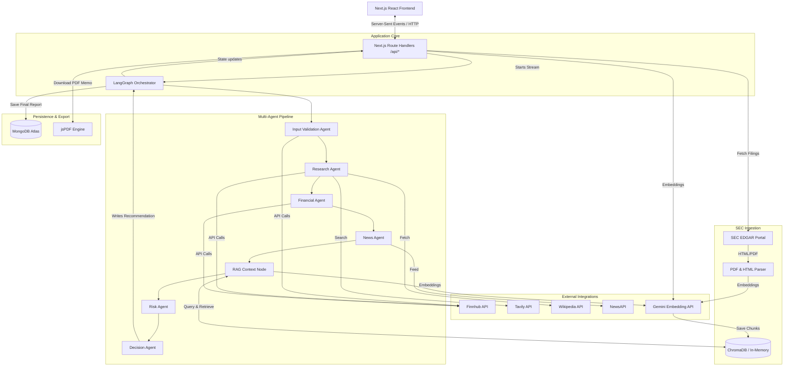

# Architecture

This document describes the high-level system architecture, technology stack, directory structure, database models, and external integrations of the StockSage investment research agent platform.

---

## Technology Stack

The application is built using a modern JavaScript/TypeScript stack:
- **Frontend & Routing**: Next.js 16 (App Router) with React 19 and Tailwind CSS v4.
- **Agent Orchestration**: LangGraph and LangChain.
- **Database**: MongoDB (via official native `mongodb` driver) for operational persistence and historical data.
- **Vector Database**: ChromaDB (with local/in-memory fallback) for retrieving contextual information from SEC filings and company reports.
- **Embeddings**: Google Gemini API (`text-embedding-004`) for generating high-dimensional dense vector embeddings.
- **Inference**: Groq Inference API running `llama-3.3-70b-versatile` for agent reasoning.
- **PDF Generation**: `jsPDF` for creating styled investment research memos.

---

## System Design & Flow

StockSage operates on a decoupled architecture where the Next.js API layer orchestrates requests, schedules tasks in a multi-agent LangGraph workflow, and streams live state updates to the React client using Server-Sent Events (SSE).

### Architectural Workflow Diagram



---

## Directory Structure

```
investment-agent/
├── app/                        # Next.js App Router Pages & API Routes
│   ├── api/                    # API Routes (SSE endpoints, imports, exports)
│   │   ├── analyze/            # SSE endpoint for running LangGraph analysis
│   │   ├── edgar/              # SEC EDGAR filing search and ingest API
│   │   ├── export/             # HTML and PDF report generator
│   │   ├── ingest/             # Vector RAG PDF document ingestion
│   │   └── trends/             # Historical recommendation snapshots
│   ├── results/                # Visual analysis dashboard
│   ├── layout.tsx              # Application shell layout
│   └── page.tsx                # Analysis launchpad page
├── components/                 # Shared UI Components
│   ├── RAGIngestionCard.tsx    # PDF upload & SEC EDGAR ingestion UI
│   └── TrendTracker.tsx        # Historical recommendation visualizer
├── docs/                       # Platform Documentation
├── lib/                        # Core Domain Logic & Agents
│   ├── agents/                 # LangGraph Agent nodes
│   │   ├── decisionAgent.ts    # Consolidates all data into a final recommendation
│   │   ├── financialAgent.ts   # Extracts and analyzes balance sheets, margins, valuation
│   │   ├── newsAgent.ts        # Analyzes news sentiment and recent market developments
│   │   ├── researchAgent.ts    # Extracts core company profile, products, competitors
│   │   ├── riskAgent.ts        # Outlines micro/macro risks, barriers, bull/bear cases
│   │   └── validationAgent.ts  # Pre-flight input validation and ticker resolution
│   ├── rag/                    # Retrieval-Augmented Generation infrastructure
│   │   └── vectorStore.ts      # ChromaDB client and local in-memory vector database
│   ├── tools/                  # SDKs and wrappers for external APIs
│   │   ├── edgar.ts            # SEC EDGAR fetcher and parser
│   │   ├── finnhub.ts          # Finnhub API client
│   │   ├── newsData.ts         # NewsAPI client
│   │   └── tavilySearch.ts     # Tavily search wrapper
│   ├── utils/                  # Shared utilities
│   │   └── rateLimiter.ts      # Exponential backoff retry handler
│   └── graph.ts                # LangGraph network compiling and runner
├── types/                      # TypeScript definitions & system interfaces
├── package.json                # Dependencies and npm scripts
└── tsconfig.json               # TypeScript configuration
```

---

## Data Schema & Operational Storage

Operational database operations are managed in [lib/mongodb.ts](file:///c:/Users/ankus/Desktop/Assigment%20Task/investment-agent/lib/mongodb.ts). The primary model is the `ReportDocument` which encapsulates the complete output of a LangGraph execution, supporting historical analysis and caching.

### `ReportDocument` Schema (MongoDB)

| Field Name | Type | Description |
| :--- | :--- | :--- |
| `_id` | `ObjectId` | Auto-generated unique database identifier. |
| `company` | `string` | Normalized full name of the analyzed corporation. |
| `ticker` | `string` | Resolved company equity exchange ticker (e.g., `MSFT`). |
| `analyzedAt` | `Date` | Timestamp recording when the analysis run occurred. |
| `verdict` | `Verdict` | Output recommendation details (INVEST/PASS, confidence, reasoning, target price). |
| `confidence` | `number` | Confidence rating percentage (0 to 100) assigned by the Decision Agent. |
| `researchData` | `Object` | Extracted corporate profile (founded, headquarters, CEO, products, competitors). |
| `financialData`| `Object` | Extracted key ratios, margins, balance sheet items, and growth percentages. |
| `newsData` | `Object` | Articles retrieved, sentiment scores, and major narratives. |
| `riskData` | `Object` | Identified business risks, sector barriers, and bull/bear scenarios. |
| `ragContext` | `string` | Combined RAG text block retrieved from SEC filings and company profiles. |
| `ragQuality` | `Object` | Quality metadata describing the retrieval effectiveness. |
| `error` | `string` | Error messages if the execution failed. |

#### `ragQuality` Metadata Schema

```typescript
ragQuality?: {
    totalChunks: number;        // Sum of all chunks retrieved from Vector DB
    tables: number;             // Count of financial tables parsed and retrieved
    footnotes: number;          // Count of reporting footnotes parsed and retrieved
    textBlocks: number;         // Count of general textual blocks retrieved
    avgRelevanceScore: number;  // Combined similarity/relevance score
    queriesIssued: number;      // Total search queries executed during retrieval
    sourcesUsed: string;        // Storage source ('chromadb' | 'mongodb' | 'in-memory')
}
```

---

## External Integrations

StockSage connects to multiple external data feeds:

1. **Groq (Inference)**: Uses Llama-3.3-70b-versatile for rapid reasoning and schema-conforming JSON extractions at a fraction of the latency of closed-source alternatives.
2. **Finnhub (Fundamentals & Ticker Resolution)**: Used to resolve company names to tickers, extract basic financial summaries, and fetch basic company details.
3. **NewsAPI (Market Sentiment)**: Provides global news articles spanning the past 7 days concerning the target asset.
4. **Tavily (Active Research)**: Used by the Research Agent to bypass static search limits, performing multi-query web lookups on current events.
5. **SEC EDGAR (Institutional RAG)**: Direct HTTP connections to SEC servers using SEC-compliant headers to crawl HTML or PDF financial filings (10-K and 10-Q).
6. **Google Gemini (Embeddings)**: High-dimension vectorization of raw documents for semantic indexation.
